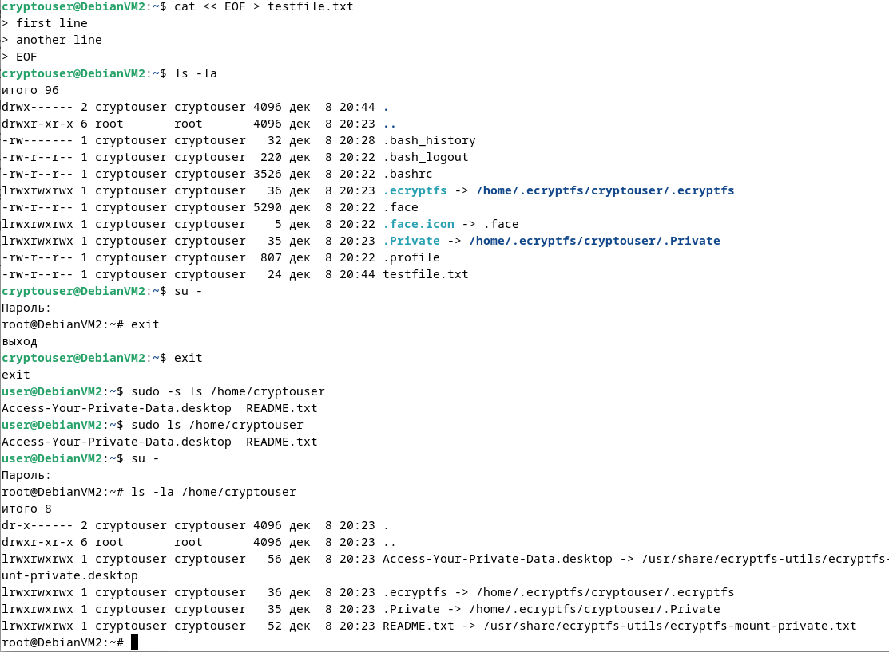
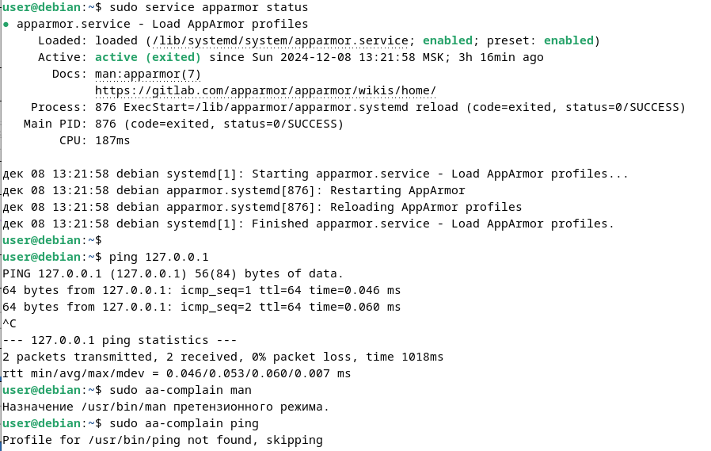
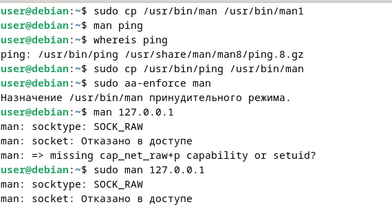
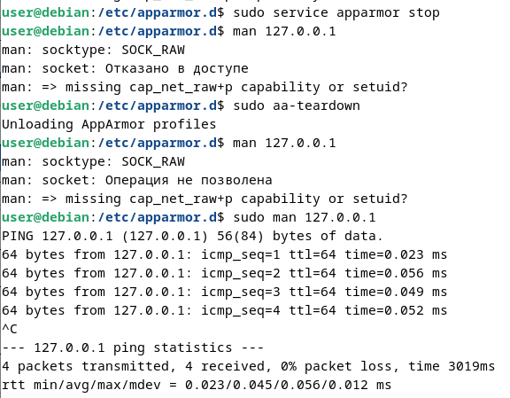

# Домашнее задание к занятию "`Защита хоста`" - `Алексеев Александр`

### Задание 1
Установите eCryptfs.
Добавьте пользователя cryptouser.
Зашифруйте домашний каталог пользователя с помощью eCryptfs.
В качестве ответа пришлите снимки экрана домашнего каталога пользователя с исходными и зашифрованными данными.  
### Ответ



--- 

### Задание 2
Установите поддержку LUKS.
Создайте небольшой раздел, например, 100 Мб.
Зашифруйте созданный раздел с помощью LUKS.
В качестве ответа пришлите снимки экрана с поэтапным выполнением задания.


### Ответ
``` bash
root@debian:~# udisksctl unmount -b /dev/sda1
Unmounted /dev/sda1.

root@debian:~# cryptsetup luksFormat /dev/sda1
ПРЕДУПРЕЖДЕНИЕ: Устройство /dev/sda1 уже содержит подпись суперблока «ext4».

ПРЕДУПРЕЖДЕНИЕ!
========
Данные на /dev/sda1 будут перезаписаны без возможности восстановления.

root@debian:~# cryptsetup open /dev/sda1 encrypted
Введите парольную фразу для /dev/sda1: 

root@debian:~# ls /dev/mapper/encrypted 
/dev/mapper/encrypted

root@debian:~# mkdir /mnt/encrypted
root@debian:~# mount /dev/mapper/encrypted /mnt/encrypted

root@debian:~# cat << EOF > /mnt/encrypted/testfile.txt
test line in new file in the encrypted volume
EOF

root@debian:~# ls -la /mnt/encrypted/
итого 24
drwxr-xr-x 3 root root  4096 дек  8 22:15 .
drwxr-xr-x 3 root root    23 дек  8 22:13 ..
drwx------ 2 root root 16384 дек  8 22:12 lost+found
-rw-r--r-- 1 root root    46 дек  8 22:19 testfile.txt

root@debian:~# cat /mnt/encrypted/testfile.txt 
test line in new file in the encrypted volume

root@debian:~# umount /mnt/encrypted 
root@debian:~# cryptsetup close encrypted 
```

---  

### Дополнительные задания (со звёздочкой*)
Эти задания дополнительные, то есть не обязательные к выполнению, и никак не повлияют на получение вами зачёта по этому домашнему заданию. Вы можете их выполнить, если хотите глубже шире разобраться в материале

### Задание 3 *
Установите apparmor.
Повторите эксперимент, указанный в лекции.
Отключите (удалите) apparmor.
В качестве ответа пришлите снимки экрана с поэтапным выполнением задания.

### Ответ
1. Установка  
``` bash
user@debian:~$ sudo apt install apparmor-utils apparmor-profiles-extra -y
```  
2. Проверка статуса и использование  



