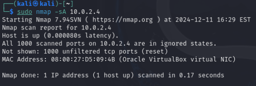
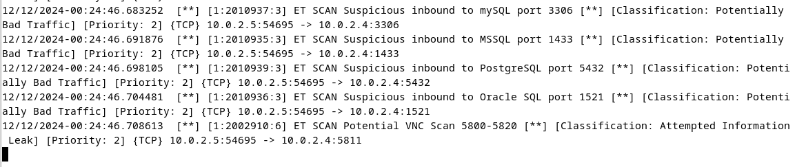

# Домашнее задание к занятию "`Защита сети`" - `Алексеев Александр`

### Подготовка к выполнению заданий
Подготовка защищаемой системы:
установите Suricata,
установите Fail2Ban.
Подготовка системы злоумышленника: установите nmap и thc-hydra либо скачайте и установите Kali linux.
Обе системы должны находится в одной подсети.

### Задание 1
Проведите разведку системы и определите, какие сетевые службы запущены на защищаемой системе:

sudo nmap -sA < ip-адрес >

sudo nmap -sT < ip-адрес >

sudo nmap -sS < ip-адрес >

sudo nmap -sV < ip-адрес >

По желанию можете поэкспериментировать с опциями: https://nmap.org/man/ru/man-briefoptions.html.

В качестве ответа пришлите события, которые попали в логи Suricata и Fail2Ban, прокомментируйте результат.

### Ответ
Защищаемый хост  
  
1. TCP ACK port scan

2. TCP connect port scan

3. TCP SYN port scan

4. Try to explore the version of the service

### Задание 2
Проведите атаку на подбор пароля для службы SSH:

hydra -L users.txt -P pass.txt < ip-адрес > ssh

Настройка hydra:
создайте два файла: users.txt и pass.txt;
в каждой строчке первого файла должны быть имена пользователей, второго — пароли. В нашем случае это могут быть случайные строки, но ради эксперимента можете добавить имя и пароль существующего пользователя.
Дополнительная информация по hydra: https://kali.tools/?p=1847.

Включение защиты SSH для Fail2Ban:
открыть файл /etc/fail2ban/jail.conf,
найти секцию ssh,
установить enabled в true.
Дополнительная информация по Fail2Ban:https://putty.org.ru/articles/fail2ban-ssh.html.

В качестве ответа пришлите события, которые попали в логи Suricata и Fail2Ban, прокомментируйте результат.

### Ответ